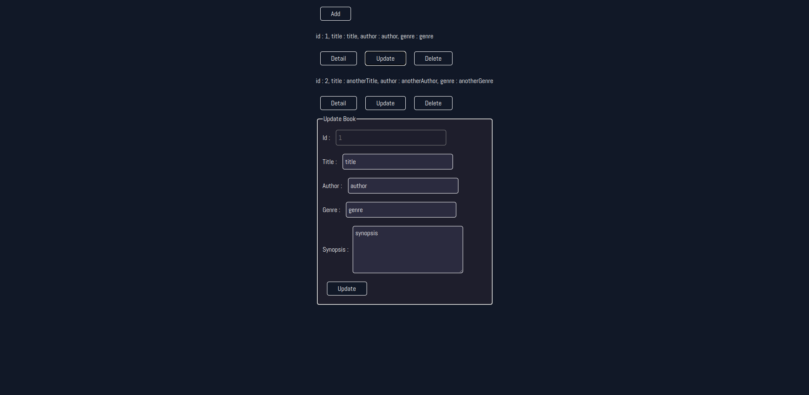

# personal-book-management

# Link
- [live Preview](https://azanra.github.io/personal-book-management/)

# About
This project focus on Create, Read, Update, and Delete operation of
book management. The user can create a book, see list of book available
, updating the book, and deleting the book. Main focus on this project is
creating each component of the user interface with javascript instead of 
HTML markup. By creating each component on it's own classes, so that i
can reuse the class whenever the component needed again.

# Review
- Study MVC architecture, As of right now, i still don't think this is 
the correct implementation of it. Because in this project the instance
of each view, will call the respective controller needed. And from the
controller it will notify the model. I wonder whether the one that trigger
the render should be started from the controller that will be the one call
the view and notify the model instead. 

Also most of the method in the controller is in the static, instead of the 
instance of the controller. When should i use static and shouldn't, and if
i do use static then what's the difference with the normal function?. From
my own code it looks like just for the sake of grouping the function.

# Screenshot

